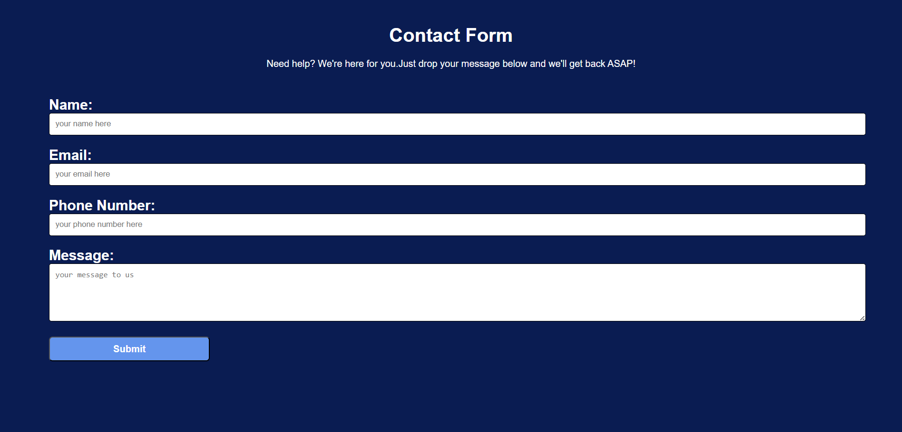

# Contact Form using HTML & CSS

This is a responsive and user-friendly contact form built using pure HTML and CSS. It's perfect for embedding into portfolio sites, service pages, or any project that needs user input.

## 🌟 Features

- Clean and modern UI
- Fully responsive layout
- Easy to integrate into any webpage
- Built with HTML5 and CSS3 (no JavaScript)

## 📸 Preview

## 🧰 Technologies Used

- HTML5
- CSS3 (Flexbox)

## 📁 Project Structure
