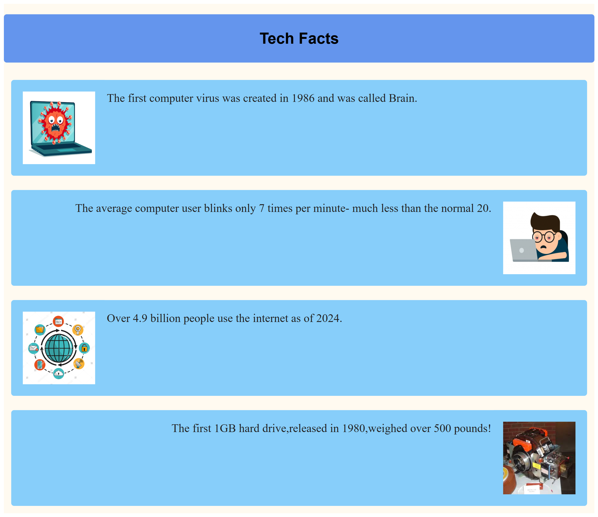

# 🌐 Tech Facts - Float Cards Layout

This project displays fun tech facts using a float-based card layout in HTML and CSS.

## ✨ Features
- Float-based alignment of cards
- Lightweight and responsive design
- Clearfix used to manage float behavior
- Includes tech-related illustrations and facts

## 🔧 Technologies Used
- HTML5
- CSS3 (float, box model, layout styling)

## 📸 Preview
 <!-- Replace with your actual screenshot name -->

## 🚀 How to Run
Just open the index.html file in any browser.

---

🔹 Created as part of my web dev practice (June 2025)  
🔹 By *Piyusha*