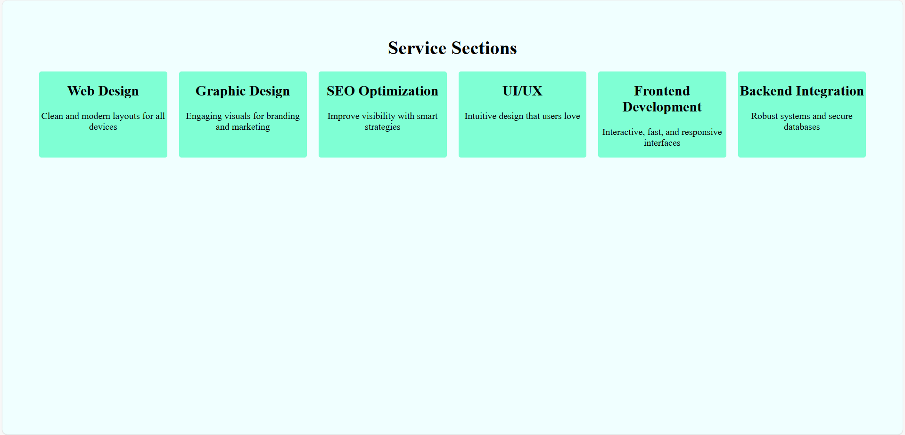
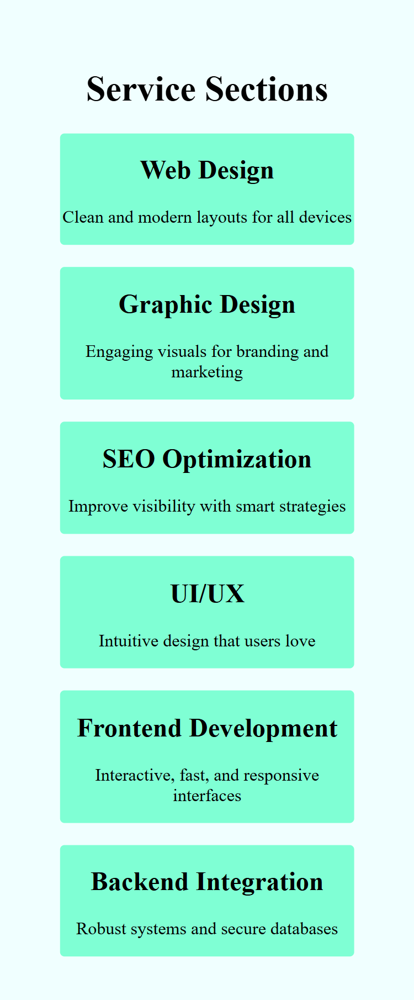

# Responsive Columns using HTML & CSS

This project demonstrates a responsive column layout created using HTML and CSS only. It adapts beautifully across desktop, tablet, and mobile devices using modern CSS techniques.

## 🌟 Features

- Responsive column layout (6 → 2 → 1 based on screen width)
- Built using HTML5 and CSS3 (no JavaScript)
- Clean structure and easy to modify
- Ideal for landing pages, cards, services, etc.

## 📸 Preview

### 💻 Desktop View

### 📱 Mobile View

## 🧰 Technologies Used

- HTML5
- CSS3 (Flexbox and Media Queries)

## 📁 Project Structure